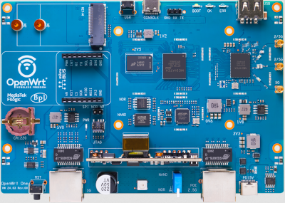

# 07 — OpenWrt on Raspberry Pi and Related Boards

## OpenWrt One router

- The OpenWrt Project is a Linux operating system targeting embedded devices. Instead of creating a single, static firmware, OpenWrt provides a fully writable filesystem with package management.
- November 29, 2024 marked the release of the **OpenWrt One**, the first router built with right-to-repair and software freedom in mind. Powered by a MediaTek MT7981B SoC, it features dual-band Wi-Fi 6 (3×3/2×2), PoE, dual Ethernet ports, and a mikroBUS expansion header. Priced at US$89, it is hacker-friendly, unbrickable, and FCC-compliant.
- For every purchase of a new OpenWrt One, a **US$10 donation** goes to the OpenWrt earmarked fund at SFC, supporting software freedom and continued OpenWrt/SFC development.

## SoC in OpenWrt (System on Chip)

- In OpenWrt, a **SoC (System on Chip)** is the main hardware chip on your router that runs Linux/OpenWrt. It integrates almost everything needed to operate the router.

## mikroBUS

- **mikroBUS™** is a standard expansion socket (hardware interface) created by **MikroElektronika**. It allows you to easily connect **Click boards** (sensor / communication / driver modules) to a microcontroller or SoC board.

mikroBUS provides:

- A fixed pinout.
- Plug-and-play style hardware expansion.
- Easy driver reuse.
- Can run a DHCP server.

## OpenWrt Comparison: CM5 vs Raspberry Pi 5 vs Raspberry Pi 4

| Feature (OpenWrt view) | CM5 (Compute Module 5) | Raspberry Pi 5 | Raspberry Pi 4 |
|---|---|---|---|
| Target use | Embedded / industrial | Desktop / general | Embedded / hobby |
| Built-in Wi-Fi radio | Yes | Yes | Yes |
| Wi-Fi driver support in OpenWrt | Good | Poor | Stable |
| WLAN AP mode (built-in Wi-Fi) | Yes | No | Yes |
| WLAN Client / WWAN mode | Yes | No (unstable) | Yes |
| AP + Client (same radio) | Limited | No | Limited |
| Ethernet (LAN/WAN) | Yes | Yes | Yes |
| LAN routing / gateway | Yes | Yes | Yes |
| USB Wi-Fi workaround | Optional | **Required** | Optional |
| Best Wi-Fi solution | Built-in radio | USB Wi-Fi dongle | Built-in radio |
| OpenWrt stability | High | Medium (Wi-Fi weak) | High |
| Suitable as router/AP | Very good | Limited (without USB Wi-Fi) | Good |
| Industry / production use | Yes | Limited | Limited |
| Reason | Better driver + embedded design | Broadcom driver limits | Mature Broadcom support |

## CM5 board — OpenWrt support

- LAN in AP mode: fully supported.
- LAN in client mode: **not** supported.
- WLAN in AP mode: fully supported.
- WLAN in client mode: supported, **but only if the radio is not already used as AP**.
- WAN in AP mode: **not** supported.
- WAN in client mode: fully supported.
- WWAN: client mode only (AP mode **not** supported).

## Raspberry Pi 4 board — OpenWrt support

- LAN in AP mode: fully supported.
- LAN in client mode: not supported.
- WLAN in AP mode: fully supported.
- WLAN in client mode: supported.
- WAN in AP mode: not supported.
- WAN in client mode: fully supported.
- WWAN in AP mode: not supported.
- WWAN in client mode: fully supported.

## Raspberry Pi 5 board — OpenWrt support

- LAN in AP mode: fully supported.
- LAN in client mode: not supported.
- WLAN in AP mode: fully supported.
- WLAN in client mode: fully supported.
- WAN in AP mode: not supported.
- WAN in client mode: fully supported.
- WWAN in AP mode: not supported.
- WWAN in client mode: fully supported.
