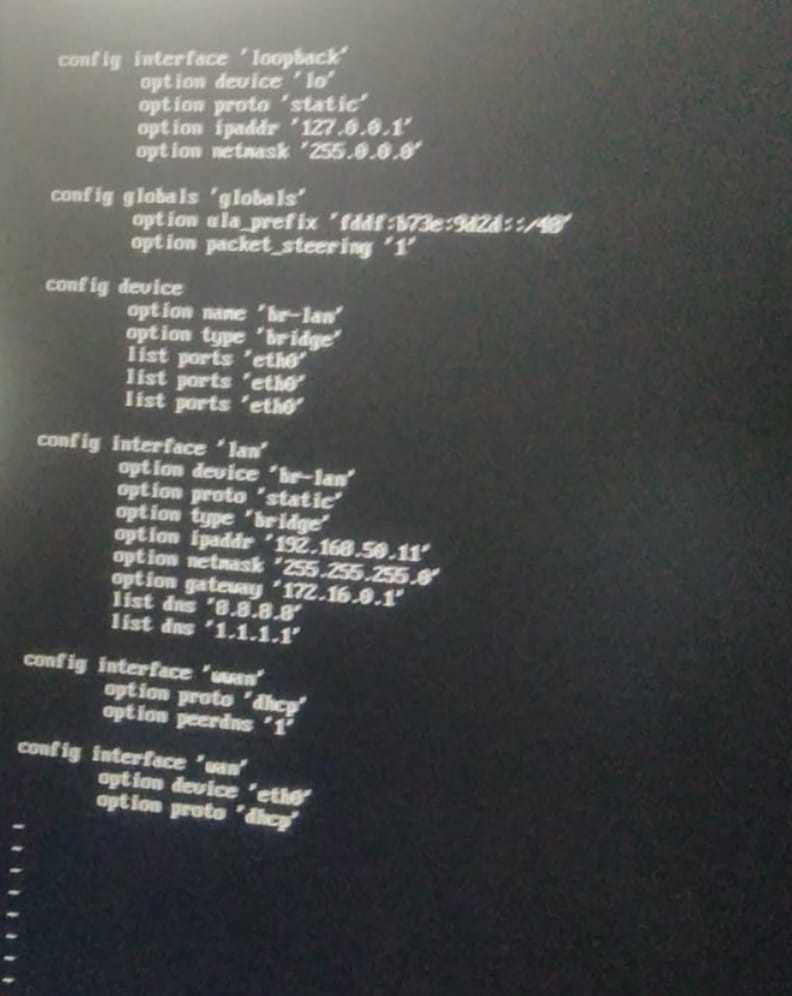

# 08 — OpenWrt Commands (Raspberry Pi boards)

Common commands used when working with OpenWrt on Raspberry Pi boards.

| Command | Description |
|---|---|
| `ip a` | First command to check network interface addresses — shows `eth0`, `phy-ap0`, and `br-lan`. |
| `cd /etc/config` | Move into the network configuration directory. |
| `ls /etc/config` | Display the list of config files in the directory. |
| `vim network` | Open the network interface config — shows IP address, subnet mask, LAN mode. |
| `vim wireless` | Open the wireless network config — shows IP address in WLAN mode. |
| `/etc/init.d/network restart` | Reboot/reset the network service. |
| `ping www.google.com` | Check whether your IP/internet connection is working correctly. |
| *(set a password)* | Required to log into the OpenWrt web UI in your browser. |

## LAN in AP mode — example config

See screenshot below for an example `network`/`wireless` configuration used to set up LAN in AP mode.

> A machine-readable starting point for this configuration lives in [`configs/network`](../configs/network) and [`configs/wireless`](../configs/wireless).
